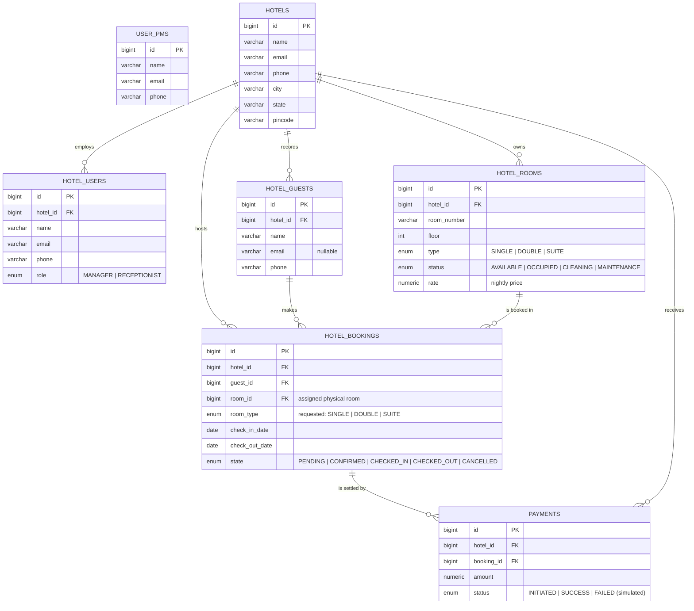

# Entity-Relationship Diagram — Hotel PMS

> Captures the data model the developer designed, with the fixes agreed during review.
> **Convention:** every table also carries metadata columns — `created_at`, `created_by`,
> `updated_at`, `updated_by` — omitted from the diagram below to keep it readable.
> This is the logical model; the physical DDL (exact Postgres types, constraints, indexes)
> is the next step.



## Notes carried from the design review

**Tenant key.** Every table except `USER_PMS` carries `hotel_id` (the platform-admin table sits
above all tenants). `PAYMENTS` also carries `hotel_id` as a denormalized tenant key for filtering,
even though the hotel is reachable via the booking.

**Payment status is derived (for now).** We deliberately did NOT store a `payment_status` on the
booking. Whether a booking is paid is *computed* from its `PAYMENTS` rows (sum of `SUCCESS`
payments vs. amount owed). If that query becomes painful, we may later add a synced cached column —
a deliberate denormalization, not a default.

**Booking references a specific room.** `room_id` is what makes the "no double-booking" rule
enforceable per physical room; `room_type` records what the guest originally requested.

## Constraints & indexes (to become DDL next)

**Unique**
- `UNIQUE (hotel_id, room_number)` — a room number is unique within its hotel.

**Indexes (per query pattern — not one-size-fits-all)**
- `hotel_id` on every tenant-scoped table (every query filters by tenant).
- `(hotel_id, room_id, check_in_date, check_out_date)` on `HOTEL_BOOKINGS` — serves the
  double-booking / availability check.
- `(hotel_id, check_in_date)` on `HOTEL_BOOKINGS` — serves by-date reports ("today's arrivals").
- `booking_id` on `PAYMENTS` — to fetch a booking's payment rows.

**Invariants that will become DB constraints (from PRD §5)**
- No two active bookings (`CONFIRMED`/`CHECKED_IN`) overlap on the same `room_id`
  → Postgres `EXCLUDE` constraint (the planned highlight).
- `check_out_date > check_in_date` → `CHECK` constraint.
- A booking's `room_id` and `guest_id` must belong to the same `hotel_id` as the booking
  → enforced in the service layer / composite FKs.
- `amount >= 0` on `PAYMENTS` → `CHECK` constraint.
```
