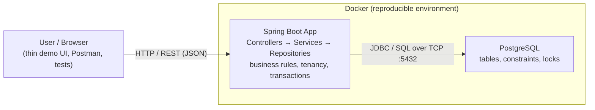

# High-Level Design — Hotel PMS

> A "boxes and arrows" view: what the pieces are, how they talk, what runs where, and *why* each
> technology was chosen. Deliberately non-detailed — class-level and schema-level detail is LLD.

## Design vocabulary (so the terms stop being fuzzy)

These three terms overlap in industry; here's the clean split:

- **System Design** — the *umbrella activity*: deciding how a whole system is structured to meet its
  requirements. In interviews it usually means *large-scale* architecture (load balancers, caches,
  queues, sharding). HLD is the main artifact it produces.
- **HLD (High-Level Design)** — the **architectural view**: the major components (boxes), how they
  communicate (protocols), where they run, the main data flows, and the technology choices + why.
  Answers *"what are the parts and how do they fit together?"* — **no class-level detail.**
- **LLD (Low-Level Design)** — the **inside of each box**: classes, interfaces, methods, design
  patterns, the ERD/schema detail, algorithms. Answers *"how is each component built internally?"*

Zoom levels: **System Design → HLD (the boxes) → LLD (inside each box).**
(Our PRD was requirements; our ERD + schema were already LLD-flavoured data design.)

## The architecture

## Components & responsibilities

| Component | Runs where | Responsibility |
|---|---|---|
| **Client** (browser / Postman / tests) | user's machine | Sends HTTP requests, shows results. The thin UI is just a window onto the backend. |
| **Spring Boot application** | app server / container | Receives REST calls; enforces business rules (no double-booking), multi-tenant filtering, transactions; orchestrates DB access. **This is where our logic lives.** |
| **PostgreSQL** | DB server / container | Stores data; enforces integrity (constraints, unique, checks) and handles concurrency (locks, the `EXCLUDE` constraint). The last line of defense for correctness. |

## How they communicate

- **Browser ↔ Spring app:** **HTTP / REST**, JSON payloads (application layer of the network stack).
- **Spring app ↔ Postgres:** **JDBC** (Java's DB connection standard) carrying SQL over TCP to `:5432`.

**Example data flow — creating a booking:**
`Browser POST /bookings` → Controller receives → Service checks the overlap rule + tenant scope →
Repository issues SQL → Postgres executes under constraints/locks → row returns up the layers →
JSON response back to the browser.

## Technology choices — and *why* (the part you asked about)

| Choice | Why this, for this project |
|---|---|
| **Java** | Strongly-typed, mature, industry-standard for backends; the language you're learning. Its strictness helps make illegal states impossible. |
| **Spring Boot** | Does the heavy lifting — dependency injection, an embedded web server, ORM wiring, transactions — so you write *business logic*, not plumbing. The de-facto standard Java backend framework. |
| **PostgreSQL** | Our core problem is **data integrity under concurrency**. Postgres is exceptional at exactly that: transactions, rich constraints, and the `EXCLUDE` constraint that can forbid overlapping bookings *at the database level*. Free, standards-compliant, powerful types. |
| **Docker** | Packaging & reproducibility (below). |

## Where Docker fits

**Docker packages an app together with its exact environment** (runtime, libraries, config) into a
**container** that runs *identically on any machine* — killing "works on my machine." For us:

- Instead of every developer hand-installing Postgres 18 + a Java runtime, we *describe* them once
  (a `Dockerfile` / `docker-compose.yml`), and anyone spins up the whole stack with one command.
- Each piece (Postgres, later the Spring app) runs in its **own container**; `docker-compose`
  starts them together and lets them talk.
- It also mirrors how apps run in production/cloud.

Right now you're running Postgres **natively** (perfectly fine for learning). Docker comes at project
setup, when reproducibility starts to matter — and you'll appreciate it more having felt the manual way.

## Status & next

- Done: scope → PRD → ERD → **schema is live in Postgres**.
- Next: scaffold the **Spring Boot project** (roadmap step 5), connect it to Postgres, then the first
  basic CRUD endpoints — where this diagram becomes running code.
